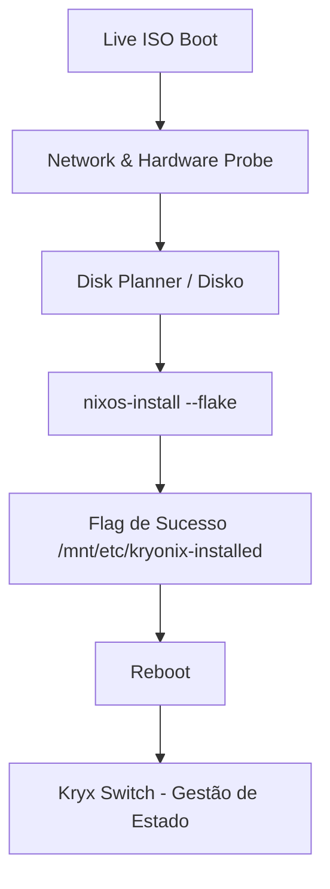

# kryonix — Kryonix NixOS Engine

> **Plataforma NixOS pessoal** para workstation, gaming, virtualização, desenvolvimento e futuras ISOs. Tudo é reproduzível, versionado em Git, e validado por `nix flake check`.

[](#compatibilidade)
[](#status)
[](#changelog)

## Descrição

O Kryonix é uma plataforma NixOS de alto desempenho, projetada para **estabilidade extrema, observabilidade nativa e cargas de trabalho críticas** (Gaming, Desenvolvimento e IA). Este repositório é o **motor/core** da distro e segue o princípio da **Verdade Operacional**: todo estado é declarativa, reproduzível e validado por testes automatizados.

O motor é composto por:

- **Módulos NixOS** (`modules/nixos/`) organizados por concern: `common`, `branding`, `features`, `input`, `hardware`, `security`, `desktop`, `services`, `boot`, `installer`, `lib/cli-lockdown`, `meta`
- **Feature Registry** (`modules/nixos/features/registry.nix`) — fonte única de verdade para metadados de cada feature (id, label, category, risk, requires, conflicts, default, status)
- **20 features canônicas** em `modules/nixos/features/`: `acme`, `ai`, `browser-automation`, `desktop`, `development`, `etcher`, `gaming`, `hermes`, `mcp`, `network`, `ntfs`, `observability`, `remote`, `security`, `server`, `storage`, `virtualization`, e mais
- **12 perfis** em `profiles/`: `desktop`, `laptop`, `vm`, `dev`, `university`, `ti`, `server-ai`, `workstation-gamer`, `virtualization`, `tools`, `glacier-base`, `glacier-ai`, `glacier-gamer`
- **30+ pacotes próprios** em `packages/`: `kryonix-hardware-probe`, `kryonix-disk-planner`, `kryonix-brain-lightrag`, `kryonix-wallpapers`, `kryonix-sddm-theme`, `kryonix-bar`, `kryonix-optimizer`, `aura`, etc
- **Home Manager** integrado via flakes (perfis declarativos por usuário)
- **CLI lockdown** (`modules/nixos/lib/cli-lockdown/`) — guarda o PATH do shell para evitar mutação não-declarativa do sistema
- **Overlay** (`overlays/`) — extensões ao `nixpkgs` com pacotes customizados
- **Lib** (`lib/`) — helpers Nix compartilhados entre módulos

Este repo é consumido como flake input pelo downstream [`kryonixos`](../kryonixos/) (hosts reais) e pelo installer daemon [`kryxd`](../kryxd/) (UI + Axum).

## 🗺️ Mapa do Repositório (Onde Fica Cada Coisa)

| Diretório | Responsabilidade | O que você encontra aqui |
|---|---|---|
| [`flake.nix`](./flake.nix) | **Ponto de entrada único** | Inputs do Nixpkgs, Home Manager, pinagens e declaração de outputs. |
| [`modules/`](./modules) | **Lógica e Módulos do Sistema** | • `modules/nixos/`: serviços, áudio, rede, branding, features canônicas.<br>• `modules/home-manager/`: configurações de usuário, shell, programas.<br>• `modules/kernel/`: kernels do sistema (Zen, CachyOS). |
| [`profiles/`](./profiles) | **Perfis Modulares** | Agrupamentos lógicos (`laptop.nix`, `desktop.nix`, `dev/`, `gaming`, etc.). O host apenas ativa o perfil. |
| [`hosts/`](./hosts) | **Bases de Hosts** | `hosts/common/` (comum a todos os hosts), `hosts/inspiron/` e `hosts/iso/`. |
| [`packages/`](./packages) | **Pacotes Próprios** | Derivações Nix para utilitários do sistema (`kryonix-hardware-probe`, `aura`, temas, wallpapers). |
| [`overlays/`](./overlays) | **Overlays Nixpkgs** | Overlays customizados e injeções no Nixpkgs upstream. |
| [`lib/`](./lib) | **Biblioteca e Opções** | Definições das opções declarativas `kryonix.*` ([`lib/options.nix`](./lib/options.nix)). |
| [`desktop/`](./desktop) | **Ambientes Gráficos** | Configurações do KDE Plasma 6 (`desktop/kde/`) e Hyprland (`desktop/hyprland/`). |
| [`docs/`](./docs) | **Documentação Central** | Todos os manuais, especificações (`docs/specs/`), skills e histórico (`docs/archive/`). |
| [`scripts/`](./scripts) | **Scripts e Automação** | Scripts operacionais e scripts de manutenção (`scripts/maintenance/`). |
| [`AGENTS.md`](./AGENTS.md) | **Diretriz Única de IA** | Documento único e consolidado para agentes e assistentes de código. |

## Status

**experimental**: features estão sendo migradas para o registry canônico (`kryonix.features.*`). Algumas features legadas (`gamer`, `profile-gamer`, pasta `features/` antiga) foram descontinuadas em favor das canônicas (`gaming`, `desktop.*`, `development.*`). Veja o catálogo de features no Vault: [`EXISTING_FEATURES_CATALOG.md`](https://github.com/RAGton/kryonix-vault/blob/main/02-Areas/Kryonix/canonical/EXISTING_FEATURES_CATALOG.md).

## Compatibilidade

| Componente        | Versão suportada                       |
|-------------------|----------------------------------------|
| NixOS             | 26.05 (Kryonix OS)                      |
| Kryonix (meta)    | 26.05                                  |
| Rust              | toolchain 1.86+ (em pacotes Rust do motor) |
| Node.js           | 22.x (na UI empacotada pelo `kryxd`)   |
| Cachix substituter | `kryonix.cachix.org` (pinned em `flake.nix`) |

## Instalação

O motor **não é instalado diretamente**: ele é consumido como flake input. Os artefatos finais (sistema instalado, ISO) vivem no downstream `kryonixos` e no installer `kryxd`.

```nix
# flake.nix do consumidor
inputs.kryonix.url = "github:RAGton/kryonix";

# usar como módulo NixOS
{ ... }: {
  imports = [ inputs.kryonix.nixosModules.default ];
  kryonix.features.gaming.enable = true;
  kryonix.profiles.glacier-base.enable = true;
}
```

Validação local:

```bash
nix flake check --keep-going --impure
nix build .#nixosConfigurations.<host>.config.system.build.toplevel.drvPath --dry-run
```

Build da Live ISO (artifacto final):

```bash
kryx build iso                          # via CLI publicada
# ou direto:
nix build .#isoImage
```

## Uso

### Quick Start (Usuários de ISO)

Se você acabou de dar boot na Live ISO do Kryonix:

1. **Conectividade**: O sistema tenta DHCP automático via Ethernet. Para WiFi, utilize a interface gráfica ou `nmcli` no terminal.
2. **Hardware Discovery**: O backend executa o `hardware-probe` automaticamente para identificar CPUs, GPUs e armazenamento disponível.
3. **Seleção de Fluxo**:
   - **Modo Recomendado**: Instalação limpa com particionamento BTRFS otimizado.
   - **Modo de Restauração**: Recuperação de sistemas Kryonix existentes.
4. **Finalização**: Clique em "Finalizar Instalação" para disparar o motor de particionamento (Disko) e o `nixos-install`.
5. **Primeiro Boot**: Após o reboot, utilize a CLI `kryx` (ou `kryonix`) para gerenciar atualizações e perfis.

### Arquitetura de Instalação

O pipeline de implantação do Kryonix é orquestrado pelo daemon [`kryxd`](../kryxd/) (Axum/Rust) e sua UI React:



1. **Provisionamento**: O `disko` cria as tabelas GPT, subvolumes BTRFS e pontos de montagem em `/mnt`.
2. **Implantação**: O `nixos-install` copia as closures diretamente da Flake local em `/etc/kryonixos`.
3. **Gestão Post-Install**: Após o boot, o comando `kryx switch` torna-se a fonte única de mutação do sistema, garantindo que o hardware reflita exatamente o que está no Git.

### Feature Registry (modelo canônico)

O registry em `modules/nixos/features/registry.nix` é a **fonte única de verdade** para metadados de features. Cada entrada tem:

| Campo              | Tipo      | Descrição                                       |
|--------------------|-----------|-------------------------------------------------|
| `id`               | string    | ID canônico (`kryonix.features.<cat>.<nome>`)   |
| `label`            | string    | Label visível na UI do installer                |
| `category`         | enum      | Categoria (ai, desktop, dev, gaming, etc)       |
| `description`       | string    | Descrição curta                                 |
| `risk`             | enum      | `low` / `medium` / `high`                       |
| `default`          | bool      | Default no profile padrão                       |
| `requires`         | [string]  | Lista de IDs que precisam estar ativos          |
| `conflicts`        | [string]  | Lista de IDs incompatíveis                      |
| `installerVisible` | bool      | Aparece no wizard do installer?                 |
| `experimental`     | bool      | Marcada como experimental na UI                 |
| `requiresReboot`   | bool      | UI avisa que precisa reboot pós-ativação        |
| `affects`          | [string]  | Categorias de impacto (kernel, services, etc)   |
| `status`           | enum      | `canonical` / `deprecated` / `experimental`     |

O registry é consumido por installer, downstream e documentação. **Não declara opções NixOS** — só metadata. As opções vivem em `modules/nixos/features/<feature>.nix`.

### Gestão de Armazenamento

O particionamento é puramente declarativo. Abaixo, a comparação técnica dos perfis de disco:

| Atributo         | Modo Recomendado (BTRFS)              | Modo Manual                            |
|------------------|---------------------------------------|----------------------------------------|
| **Filesystem**   | BTRFS com Compressão ZSTD (v3)        | Definido pelo usuário (Ext4/XFS)       |
| **Hierarquia**   | Subvolumes: `@`, `@home`, `@nix`, `@log` | Ponto de montagem raiz (`/`) obrigatório |
| **Estratégia**   | Otimizada para longevidade de SSD/NVMe | Intervenção mínima do motor          |
| **Resiliência**   | Snapshots atômicos e COW habilitado   | Gestão manual de integridade           |
| **Mount Options**| `compress=zstd,noatime,ssd`           | Padrões do kernel                      |

### Modo de Restauração (State Awareness)

O instalador é "consciente" do estado atual dos discos. Ele detecta instalações anteriores via:
- Labels de partição: `NIXOS-SYSTEM` e `NIXOS-HOME`.
- Arquivo de flag: `/mnt/etc/kryonix-installed`.
- Estrutura Git: Presença de `flake.lock` em diretórios de configuração conhecidos.

**Vantagem**: Ao selecionar a restauração, o sistema pula a formatação destrutiva e utiliza os subvolumes existentes, permitindo reinstalar o SO ou trocar de host sem perder os dados do usuário em `/home`.

### Gerenciamento de Perfis

O Kryonix utiliza um sistema de perfis modulares que podem ser ativados via `patching` declarativo no `flake.nix` do host.

**Features disponíveis (exemplos)**:
- **Gaming**: Stack completo (`steam`, `lutris`, `gamemode`, `mangohud`, etc). *Nota: a feature legada `gamer` / `profile-gamer` foi descontinuada e substituída pela canônica `gaming`.*
- **Development**: Stack modular (`rust`, `python`, `nix`, etc).
- **AI**: Local LLMs via `kryonix-brain-lightrag` + `kryonix-llama-cpp-cuda`.
- **Virtualization**: KVE/Incus integration (consumido pelo [`kryxd`](../kryxd/)).
- **Hermes**: agente IA local com skill system.

**Perfis disponíveis**:
- `glacier-base` / `glacier-ai` / `glacier-gamer` — perfis específicos para o host Glacier
- `laptop`, `desktop` — perfis genéricos
- `workstation-gamer` — workstation com stack gaming
- `server-ai` — servidor com foco em inferência local
- `vm` — VM genérica
- `dev`, `university`, `ti`, `tools`, `virtualization` — perfis especializados

**Ativação manual (exemplo)**:

No arquivo `/etc/kryonixos/hosts/<host>/default.nix`:

```nix
{ config, lib, pkgs, ... }: {
  # Ativando features canônicas
  kryonix.features.gaming.enable = true;
  kryonix.features.development.enable = true;
  kryonix.features.development.languages.rust.enable = true;

  # Aplicando perfil
  kryonix.profiles.glacier-base.enable = true;
}
```

### CLI Lockdown (proteção declarativa)

`modules/nixos/lib/cli-lockdown/` implementa um **shim no PATH** que bloqueia comandos destrutivos fora do contexto declarativo (`nix`, `nixos-rebuild`, `rm -rf`, etc). Toda mutação do sistema passa por `kryx switch` ou `kryx update`, que invocam o Nix com paths absolutos do `/nix/store`.

Workaround canônico (quando precisa invocar `nix` direto):

```bash
PATH="/run/current-system/sw/bin:/run/wrappers/bin:/home/rocha/.nix-profile/bin:/usr/bin:/usr/local/bin" \
  /run/current-system/sw/bin/nix --extra-experimental-features 'nix-command flakes' \
    flake check --keep-going --impure
```

Alternativa transparente: `kryx build` (wrapper) com `--no-write-lock-file`.

### Desenvolvimento e Testes

Para garantir que a ISO nunca quebre, utilizamos um ambiente de virtualização automatizado.

**Teste de Boot em VM (QEMU/KVM)**:

O script de teste emula o hardware real, carrega a ISO e valida a API do instalador.

```bash
# 1. Build da ISO (Gera o artefato .iso)
kryx build iso

# 2. Executa a validação em sandbox
./scripts/test-iso-boot.sh
```

**O que o script valida**:
- Bootabilidade UEFI.
- Disponibilidade da API Axum (Porta 8080).
- Integridade do sistema de arquivos live.

### Observabilidade e Telemetria

Toda instância Kryonix reporta sua identidade técnica em `/etc/kryonix-version`.
- **Conteúdo**: Commit Hash, Build Timestamp e Pretty Name.
- **Telemetria**: Ping semanal anônimo para `telemetry.kryonix.org` (opcional e desativado por padrão) para mapeamento de compatibilidade de hardware.

### Catálogo de Features

A lista oficial de features canônicas e seus estados de migração está documentada no Vault:
[Catálogo de Features do Kryonix](https://github.com/RAGton/kryonix-vault/blob/main/02-Areas/Kryonix/canonical/EXISTING_FEATURES_CATALOG.md)

### Mapa da Documentação

A documentação canônica vive no **Vault Obsidian** (`github:RAGton/kryonix-vault`), sob `02-Areas/Kryonix/canonical/`. Os links abaixo apontam para os arquivos reais (os antigos `docs/*.md` foram consolidados no vault):

- **[Estado Atual](https://github.com/RAGton/kryonix-vault/blob/main/02-Areas/Kryonix/kryonix-meta/CURRENT_STATE.md):** O que está implementado, o que é parcial e o que está quebrado.
- **[Roadmap](https://github.com/RAGton/kryonix-vault/blob/main/02-Areas/Kryonix/kryonix-meta/ROADMAP.md):** Planejamento de futuras versões.
- **[Arquitetura](https://github.com/RAGton/kryonix-vault/blob/main/02-Areas/Kryonix/canonical/Architecture.md):** Como as peças se encaixam dentro do engine.
- **[Operações](https://github.com/RAGton/kryonix-vault/blob/main/02-Areas/Kryonix/canonical/Operations.md):** Como rodar, testar e fazer build.
- **[Segurança](https://github.com/RAGton/kryonix-vault/blob/main/02-Areas/Kryonix/canonical/Security.md):** Políticas de secrets, MCP e diretrizes de hardening.
- **[Usage / CLI](https://github.com/RAGton/kryonix-vault/blob/main/02-Areas/Kryonix/canonical/Usage.md):** Referência de comandos da CLI `kryx`/`kryonix`.

> A wiki GitHub (`github:RAGton/kryonix/wiki`) é a porta de entrada amigável para humanos; o vault é a fonte canônica para agentes e decisões.

### Diretórios Principais do Engine

```
.
├── modules/nixos/                 # módulos NixOS organizados por concern
│   ├── common/                    # imports comuns a todos os hosts
│   ├── branding/                  # kryonix-branding
│   ├── features/                  # 20 features canônicas + registry
│   ├── input/                     # gestão de input devices
│   ├── hardware/                  # hardware genérico (CPU, GPU, rede)
│   ├── security/                  # apparmor, sandbox, cli-lockdown
│   ├── desktop/                   # wallpaper, sddm, kde, caelestia
│   ├── services/                  # n8n, home-assistant, tailscale, snapper, tlp, kryxd
│   ├── boot/                      # kernel, bootloader, initrd
│   ├── installer/                 # hooks de instalação
│   ├── lib/cli-lockdown/          # guarda do PATH do shell
│   └── meta/                      # metadata do sistema
├── features/                      # LEGACY: features descontinuadas (manter pra histórico)
├── profiles/                      # 12 perfis canônicos
├── packages/                      # 30+ pacotes próprios (Rust + Nix)
├── overlays/                      # extensões ao nixpkgs
├── lib/                           # helpers Nix compartilhados
├── desktop/                       # configs KDE Plasma 6 (migração de Hyprland)
├── hosts/                         # hosts pré-configurados (ISO)
├── specs/                         # specs funcionais (markdown)
├── docs/                          # docs legados (consolidados no vault)
├── scripts/                       # scripts auxiliares (find_aliases, rename_dirs)
├── tests/                         # testes NixOS VM
├── flake.nix                      # outputs: nixosConfigurations, packages, lib, overlays
└── iso.nix                        # derivação da Live ISO
```

## Repos relacionados

Este repo integra com (cross-links via `../<repo>/README.md`):

- [`kryonixos`](../kryonixos/): downstream / hosts reais (consome este motor)
- [`kryxd`](../kryxd/): KCP daemon + Installer + UI (consome este motor como flake input)
- [`kryx-cli`](../kryx-cli/): CLI unificada `kryx` que opera sobre hosts deste motor
- [`kryonix-brain-lightrag`](../kryonix-brain-lightrag/): RAG engine (LightRAG, FastAPI)
- [`kryonix-home`](../kryonix-home/): organizador de home directory (Rust CLI)
- [`kryonix-aura`](../kryonix-aura/): agente Aura (launcher/provider)
- [`kryonix-assets`](../kryonix-assets/): wallpapers, temas, branding
- [`kryonix-vault`](../kryonix-vault/): Obsidian vault (memória, ADRs, logs)

Veja [`AGENTS.md`](../../AGENTS.md) do meta-repo para a visão consolidada do workspace.

## Contribuição

Mudanças neste motor afetam **todos os hosts do downstream**. Antes de commitar:

1. `nix flake check --keep-going --impure` (validação estática completa)
2. `kryx build .#nixosConfigurations.<host>.config.system.build.toplevel.drvPath --dry-run --no-write-lock-file` para pelo menos 1 host (`glacier`, `inspiron`, ou `inspiron-nina`)
3. Validar que o `flake.lock` não foi regerado sem autorização (`.git diff flake.lock` deve estar limpo)

Gate humano obrigatório para `kryx switch` em produção (sempre o humano, nunca o agente). Veja [`AGENTS.md`](AGENTS.md) deste repo para regras de workflow, anti-scope-creep, e path explícito em `git add` (nunca `git add .`).

## Licença

Unfree (uso interno Kryonix).

## Changelog

- **2026-08-02**: reescrito sob template canônico (`agents/kryonix-core/README-TEMPLATE.md`) — badges Shields.io, seções Status + Descrição + Instalação + Contribuição + Licença expandidas, árvore de diretórios completa, modelo de Feature Registry documentado, ordem canônica aplicada (1 H1 no topo).
- **2026-08-02**: sincronizado com template canônico — seção Compatibilidade + Repos relacionados adicionadas.
- **2026-08-02**: Motor da distro (módulos NixOS/HM, features opt-in, CLI base)
